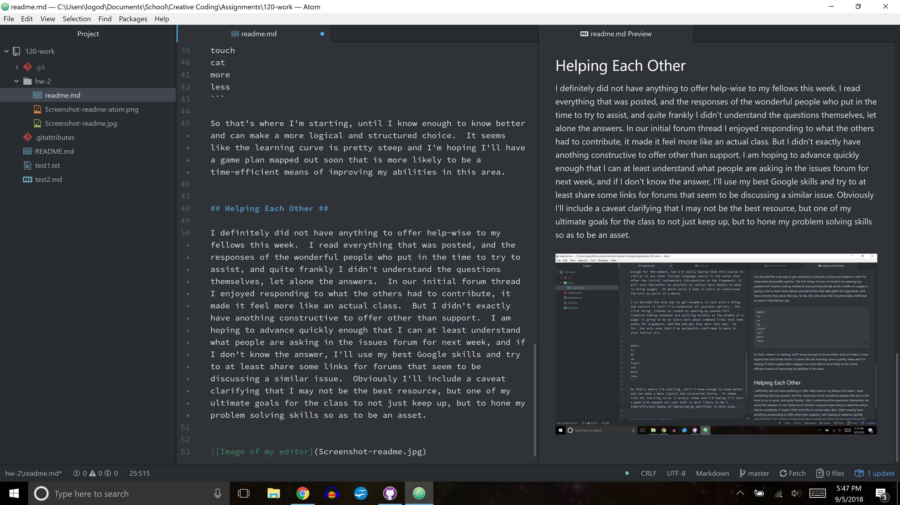

Tiffany Gross

# Overview of Week II

## Work Done In This Homework Cycle

- I worked through [_Unix For the Beginning Mage_](http://unixmages.com/ufbm.pdf) and found it difficult as a brand new beginner, but I loved the format, which made a huge difference.

- I experimented with the command line and took extensive notes on the course material as well as everything that went wrong and how I either stumbled into fixing it, or the most helpful alternative solutions found in forums after a Google search.
- Finally received my textbook today and began slowly familiarizing myself with _Getting Started With p5.js_
- Explored [**GitHub**](https://github.com/) and the included tutorials
- Created new repositories
- Downloaded and set up **Atom** following the recommended guidelines
- Learned what _markdown_ is and am currently experimenting with how to use it most efficiently

## Steps Taken to Complete This Assignment ##

1. Created my _GitHub_ account.
2. Installed _GitHub_ desktop application.
3. Chose _Atom_ as my preferred text editor and installed it, making it the default text editor.
4. Followed step-by-step through the course module/material and examples in order to learn how to create content, edit it, summarize it and commit it.

## Problems and Issues ##

I definitely have run into a whole hoarde of issues with this brand new language on these brand new platforms.  But I wouldn't necessarily call andy of them _problems_ per se. Each time it happened, it just meant that some extra time and thought was required (so far more time than any other classes I've taken, and I've been in college bouncing around different disciplines for almost ten years) but not necessarily more thought, just a different mode of thinking.  I'm finding it to be extrememely stimulating.
The most exciting problem occurred when I was first learning my way around the terminal and spent literal hours trying to navigate back to the home directory using `cd/Users/logod` and it never worked.  Eventually, and **completely** by random chance, I typed `cd/c/Users/logod` and lo and behold, I could navigate back to the absolute directory.  I have never in my life heard of hard drives having names, or there being such a thing as multiple hard drives, so this solution out of thin air baffled me to the point where I had to step outside for a smoke break. And I'm still completely baffled, but it was an amazing feeling to solve an issue like that, even if I still don't understand how it came about.  Maybe God.  (Just kidding.)

## Things I Might Like to Discuss Further ##

To be quite honest, there's not a single part of any of this I don't intend to delve into more in my free time.  As of now, along with holding down two jobs and being in school full time, this class is taking up the largest slice of my time by far, and leaving slightly less than nothing as far as free time is concerned.  Just keeping up with the deadlines is more than enough for the moment, but I'm really hoping that this course is similar to any other foreign language course in the sense that after the initial rudimentary introduction to the framework, it will soon thereafter be possible to reflect more deeply on what is being taught.  At which point I hope to start to understand the bits as parts of a whole.

I've decided the only way to get anywhere is just pick a thing and explore it until I've exhausted all possible options.  The first thing, (chosen at random by opening my packed-full Creative Coding notebook and pointing blindly at the middle of a page) is going to be to learn more about command lines that take paths for arguments, and how and why they work that way.  So far, the only ones that I've personally confirmed to work in that fashion are:

```
mkdir
ls
mv
cp
touch
cat
more
less
```

So that's where I'm starting, until I know enough to know better and can make a more logical and structured choice.  It seems like the learning curve is pretty steep and I'm hoping I'll have a game plan mapped out soon that is more likely to be a time-efficient means of improving my abilities in this area.


## Helping Each Other ##

I definitely did not have anything to offer help-wise to my fellows this week.  I read everything that was posted, and the responses of the wonderful people who put in the time to try to assist, and quite frankly I didn't understand the questions themselves, let alone the answers.  In our initial forum thread I enjoyed responding to what the others had to contribute, it made it feel more like an actual class.  But I didn't exactly have anothing constructive to offer other than support.  I am hoping to advance quickly enough that I can at least understand what people are asking in the issues forum for next week, and if I don't know the answer, I'll use my best Google skills and try to at least share some links for forums that seem to be discussing a similar issue.  Obviously I'll include a caveat clarifying that I may not be the best resource, but one of my ultimate goals for the class to not just keep up, but to hone my problem solving skills so as to be an asset.



